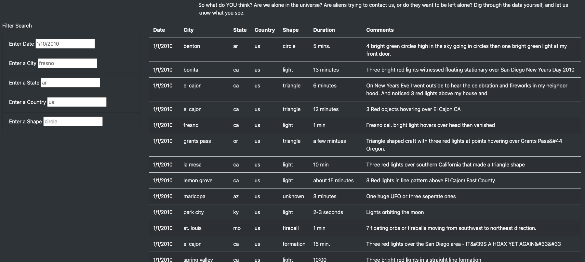
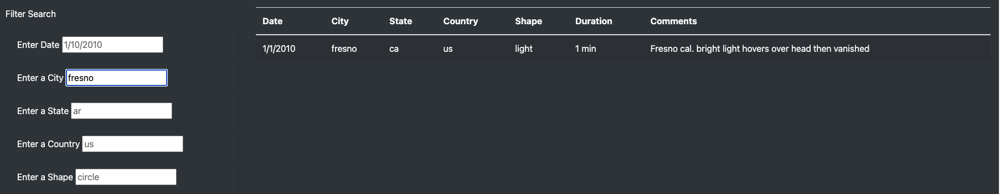

# UFOs

## Overview

The purpose of the project is to create a webpage with a table with data of UFO sightings. Then, filters were applied to allow users to perform a criteria based search. The five filters that were applied were: date, city, state, country and shape. The software and applications used to create this webite were: JavaScript, HTML, CSS, Python, Visual Studio Code and Jupyter Notebook. 

## Results 

To perform a search on the website is very simple. Previews of how to format your search for each criteria are provided in each search box. 

Then, once you know what you want to search for, simply type it in the search box and click enter or click anywhere on the screen, and the website will automatically filter the table. For instance, if we wanted to search for all UFO sightings in Fresno our table would look like this:

## Summary

The one drawback to this development is that the search criteria is case sensitive. Fortunately, previews in the search box provides a model for the user; however, there are no explicit instructions on the website on how to use the filters. One reccomendation would be to edit the code so that users can search freely regardless of case restrictions. Another would be to re-add the filter button. For instance, say you wanted to add multiple filters such as state" "ar", country: "us" and shape: "circle." As you add the filters, the table will automatically update. I believe this will only add confusion for users so the addition of a filter button would provide simplicity and comfort for users. 
